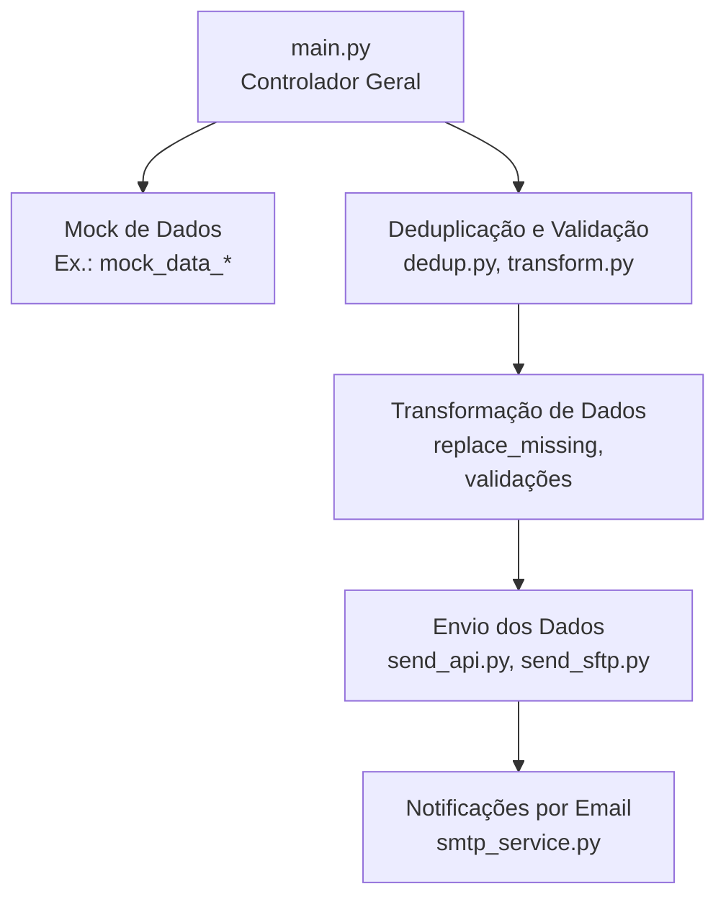
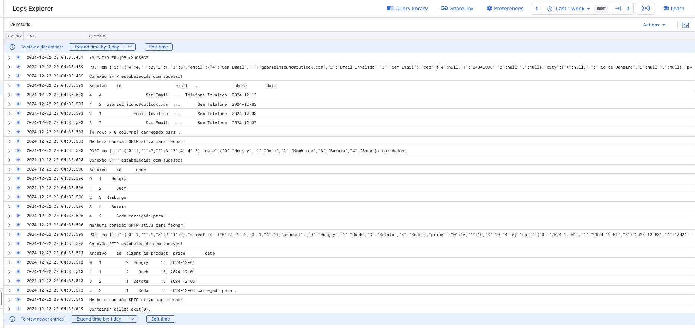
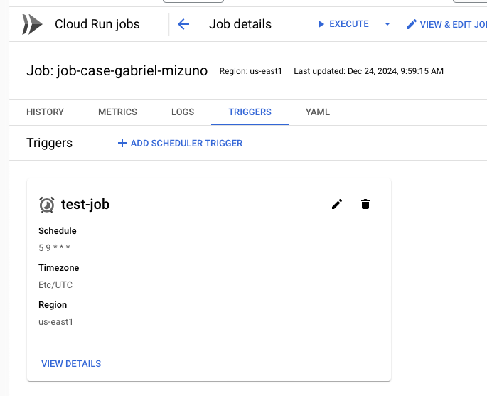
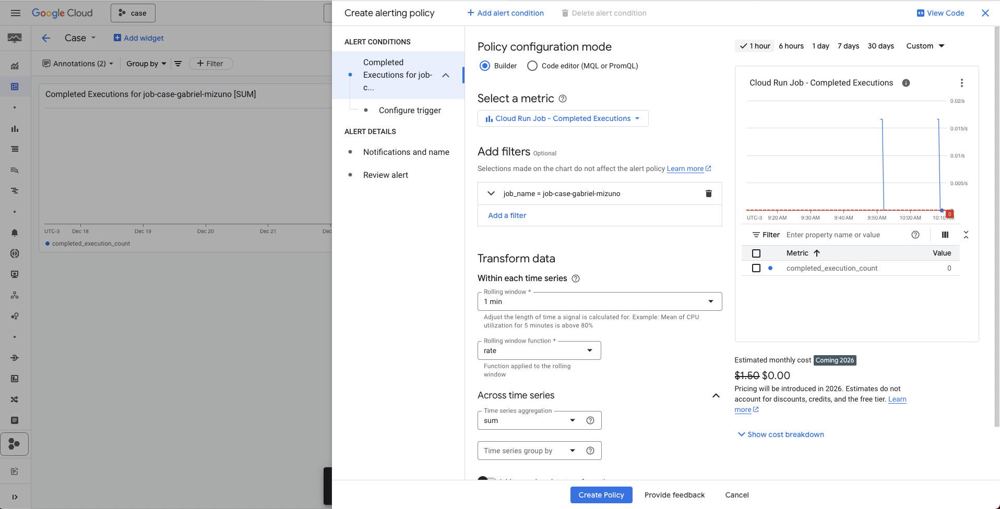

# Case Gabriel Mizuno

Nesse case foquei em mostrar quais métodos e como organizar o código, visando deixar o código claro e simples.
Na útlima seção deixei alguns pontos de melhorias numa seção no final.

## Arquiterura
1. **Mock de Dados**:
    - Dados simulados de _clientes_, _produtos_ e _transações_ em formato `pandas.DataFrame`.
      **Arquivos**: `client.py`, `products.py`, `transaction.py`.

2. **Deduplicação e Transformação**:
    - **Deduplicação**: Remove duplicatas baseando-se em colunas específicas:
        - _Clientes_: Mantém o registro mais recente por ID.
        - _Transações_: Mantém o registro mais recente por ID e produto.
          **Arquivo**: `dedup.py`.

    - **Transformação**: Limpeza e validação de dados:
        - Substituição de valores nulos.
        - Validação de email/telefone.
        - Filtro de preços inválidos em transações.
          **Arquivos**: `transform_client.py`, `trasnform_transaction.py`, `transform.py`.

3. **Envio dos Dados**:
    - **API**: Envia os dados em formato JSON a endpoints remotos.
      **Arquivo**: `send_api.py`.
    - **SFTP**: Faz upload de dados para servidores remotos.
      **Arquivo**: `send_sftp.py`.

4. **Notificações**:
    - Envio de email para comunicar status (sucesso ou erro).
      **Arquivo**: `stmp_service.py`.

#### **Componentes Principais**
- **Validação e Regras de Negócio**:
    - Validação de formatos (ex.: email, telefone).
      **Arquivo**: `validations.py`.

- **Manipulação de Erros**:
    - Tratamento de erros de conexão, permissões ou dados incorretos.
      **Arquivo**: `error.py`.

- **Controlador Principal**:
    - Orquestra todo o fluxo:
        1. Prepara os dados (deduplicação e transformação).
        2. Envia para os endpoints (API, SFTP).
        3. Gera notificações.
           **Arquivo**: `main.py`.

### **Resumo da Implementação**
1. Dados estão em **mock** (`pandas`).
2. Processamento (deduplicação e validação) organiza e corrige problemas.
3. Dados são enviados para:
    - **APIs**: Consumidas via `APIConnection`.
    - **SFTP**: Transferência com autenticação.

4. Comunicação por email para notificar sucesso ou falhas.

## Criação e Limpeza de Base
**Tratamento de valores nulos:**

1.   Transaction: Itens com preço nulo serão desconsiderado
2.   Clients: Clientes sem e-mail preenchido corretamento serão substituidos por "Sem Email", clientes sem telefone preenchido corretamento serão substituidos por "Sem Telefone",
3.   Products: Nenhum tratativa será feita nessas tabelas, pois assumisse que essa tabela terá os campos corretamente preenchidos

**Deduplicação:**

1.   Transaction: Dado um id de transação so podemos ter 1 único por pedido, ou seja, a chave primária será a concatenação do id com Product. No exemplo a abaixo o segundo item será desconsiderado

| id | Product | Quantity | Date       |
|----|---------|----------|------------|
| 1  | XXX     | 1        | 2024-10-01 |
| 1  | XXX     | 2        | 2024-10-02 |


2.   Clients: Como o objetivo desssa tabela será manter um canal de contato mais atualizado em caso de id duplica será deletado o registro mais antigo.

| id | Emial | Date       |
|----|-------|------------|
| 1  | XXX   | 2024-10-01 |
| 1  | XXX   | 2024-10-02 |

Outro cenario possível é de clientes com id diferentes mais com mesmo email. Nesse caso séra mantido ambos registros

**Correção de inconsistências de formato:**

1.   Transaction: Transações com valores negativos será desconsideras
2.   Clients:

    *   Email que não seguirem um padrão serão substituidos por Email Inválido
    *   Telefone que não seguirem um padrão serão substituidos por Telefone Inválido

## Automação do Processo

Para automação do job foi utilizado o GCloud e Cloud Run para execução, existem duas possibilidades; Terraform ou Gcloud (linha de comando). Para
esse case usarei o Gcloud.

OBS: link para [Terraform](https://registry.terraform.io/providers/hashicorp/google/latest/docs/resources/cloud_run_v2_job) e [GCloud](https://cloud.google.com/run/docs/create-jobs)

```bash

gcloud run jobs deploy job-case-gabriel-mizuno \
    --source . \
    --tasks 1 \
    --max-retries 5 \
    --region us-east1 \
    --project=case-445517 \
    --set-secrets=API_SECERT_KEY=aiqfome_password:1,API_USER_KEY=aiqfome_host_api:1,SFPT_KEY=aiqfom_keysftp:1
```




Como esse código conseguimos criar um job SEM agendamento. Para realizar um agendamento basta executar o seguinte codigo

```bash

gcloud scheduler jobs create http test-job --schedule "5 9 * * *" \
       --location='us-east1' \
       --http-method='POST' \
       --uri="https://us-east1-run.googleapis.com/apis/run.googleapis.com/v1/namespaces/case-445517/jobs/job-case-gabriel-mizuno:run" \
       --oidc-service-account-email=953749029646-compute@developer.gserviceaccount.com  \
       --oidc-token-audience="https://us-east1-run.googleapis.com/apis/run.googleapis.com/v1/namespaces/case-445517/jobs/job-case-gabriel-mizuno:run" 
```



Após a execução dos comandos, será necessário criar um alerta manualmente no Cloud Monitoring, como mostrando na imagem abaixo



Pensando em melhorias e maior automação;

- [Artifact Registry](https://cloud.google.com/artifact-registry/docs)
- Github ou Gitlab
- Uso de outros Vaults

## Guardrails e Monitoramento

Em caso de falha um email será enviado para uma lista de emails, previamente definida. Já em caso de sucesso, também será enviado
um email informando que pipeline foi executado com sucesso
Quanto aos alertas será necessário criar umas configurações no Cloud Monitoring. Como mostra as imagens abaixo


## Pontos de melhoria

- Uso do Terraform para automatizar todas as etapas (Deploy, Agendamento e Monitoramento)
- Separação das responsabilidades (pequenos projetos + pip install)
- Factory para parte de monitoramento ou Pub/Sub e Cloud Functions
- Great Expections antes de enviar os dados 